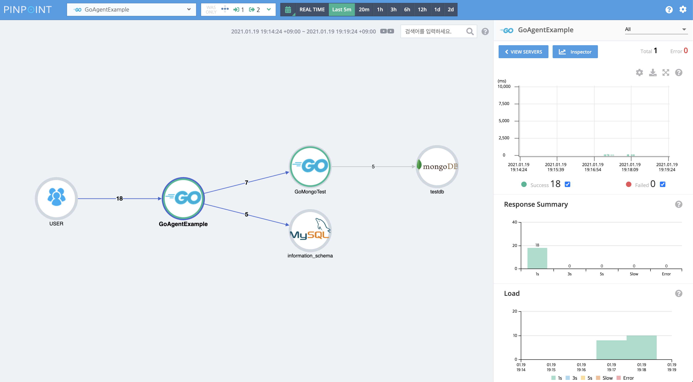

# Pinpoint Go Agent

Pinpoint Go Agent is a library that allows Go applications to be monitored through pinpoint.
Since Go is a compiled language and does not have a virtual machine like Java, developers must add code that uses the pinpoint Go Agent API to the source code to instrument the Go application.
See the documents below for more information.

 * [Quick Start](doc/quick_start.md)
 * [Plugin Guide](/doc/plugin_guide.md)
 
## Install
```
go get -u github.com/pinpoint-apm/pinpoint-go-agent
```

``` go
import pinpoint "github.com/pinpoint-apm/pinpoint-go-agent"
```

## Requirements
* Go 1.12+
* Pinpoint 2.1.1+

## Example

``` go
package main

import (
	"io"
	"log"
	"net/http"

	pinpoint "github.com/pinpoint-apm/pinpoint-go-agent"
	phttp "github.com/pinpoint-apm/pinpoint-go-agent/plugin/http"
	_ "github.com/pinpoint-apm/pinpoint-go-agent/plugin/mysql"
)

func index(w http.ResponseWriter, r *http.Request) {
	io.WriteString(w, "hello world")
}

func outgoing(w http.ResponseWriter, r *http.Request) {
	client := phttp.WrapClient(nil)

	request, _ := http.NewRequest("GET", "http://localhost:9000/mongo", nil)
	request = request.WithContext(r.Context())

	resp, err := client.Do(request)
	if nil != err {
		io.WriteString(w, err.Error())
		return
	}
	defer resp.Body.Close()
	io.Copy(w, resp.Body)
}

func main() {
	opts := []pinpoint.ConfigOption{
		pinpoint.WithAppName("GoAgentExample"),
		pinpoint.WithAgentId("GoAgentLocalhost"),
		pinpoint.WithCollectorHost("localhost"),
	}
	cfg, _ := pinpoint.NewConfig(opts...)
	agent, err := pinpoint.NewAgent(cfg)
	if err != nil {
		log.Fatalf("pinpoint agent start fail: %v", err)
	}

	http.HandleFunc(phttp.WrapHandleFunc(agent, "index", "/", index))
	http.HandleFunc(phttp.WrapHandleFunc(agent, "outgoing", "/outgoing", outgoing))

	http.ListenAndServe(":8000", nil)
	agent.Shutdown()
}
```

## Screen Shot
 

## Plug-ins
| project | plugin |
| ------------- | ------------- |
| [chi](https://github.com/go-chi/chi) | [plugin/chi](plugin/chi) |
| [echo](https://github.com/labstack/echo) | [plugin/echo](plugin/echo) |
| [gin](https://github.com/gin-gonic/gin) | [plugin/gin](plugin/gin) |
| [gocql](https://github.com/gocql/gocql) | [plugin/gocql](plugin/gocql) |
| [go-elasticsearch](https://github.com/elastic/go-elasticsearch) | [plugin/goelastic](plugin/goelastic) |
| [gohbase](https://github.com/tsuna/gohbase) | [plugin/gohbase](plugin/gohbase) |
| [go-redis](https://github.com/go-redis/redis) | [plugin/goredis](plugin/goredis), [plugin/goredisv8](plugin/goredisv8) |
| [grpc](https://google.golang.org/grpc) | [plugin/grpc](plugin/grpc) |
| [http](https://google.golang.org/http) | [plugin/http](plugin/http) |
| [logrus](https://github.com/sirupsen/logrus) | [plugin/logrus](plugin/logrus) |
| [mongo-driver](https://go.mongodb.org/mongo-driver) | [plugin/mongodriver](plugin/mongodriver) |
| [mysql](https://github.com/go-sql-driver/mysql) | [plugin/mysql](plugin/mysql) |
| [pgsql](https://github.com/lib/pq) | [plugin/pgsql](plugin/pgsql) |
| [sarama](https://github.com/Shopify/sarama) | [plugin/sarama](plugin/sarama) |

## License

```
Copyright 2020-present NAVER Corp.

Licensed under the Apache License, Version 2.0 (the "License");
you may not use this file except in compliance with the License.
You may obtain a copy of the License at

   http://www.apache.org/licenses/LICENSE-2.0

Unless required by applicable law or agreed to in writing, software
distributed under the License is distributed on an "AS IS" BASIS,
WITHOUT WARRANTIES OR CONDITIONS OF ANY KIND, either express or implied.
See the License for the specific language governing permissions and
limitations under the License.
```
