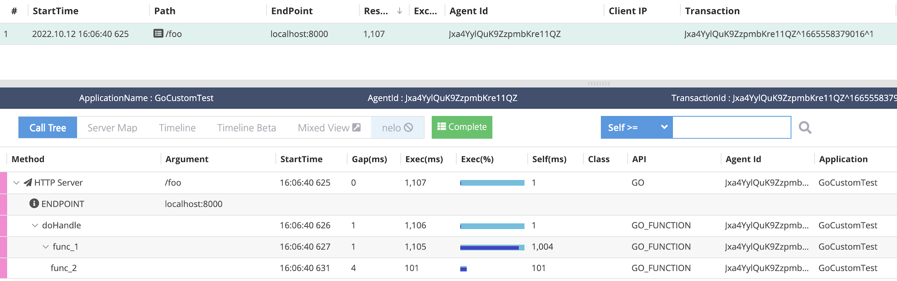
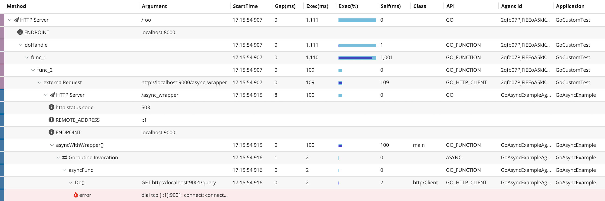

# Custom Instrumentation

Pinpoint Go Agent enables you to monitor Go applications using Pinpoint.
Go applications must be instrumented manually at the source code level,
because Go is a compiled language and does not have a virtual machine like Java.

There are two ways to instrument your applications:

* Using plugin packages.
* Custom instrumentation with the Pinpoint Go Agent API.

Pinpoint Go Agent provides plugins packages to help developers trace the popular frameworks and toolkits.
These packages help you to make instruments with simple source code modifications.
For more information on plugin packages, refer [Plugin User Guide](plugin_guide.md).

## Overview

In Pinpoint, a transaction consists of a group of Spans.
Each span represents a trace of a single logical node where the transaction has gone through.
A span records important function invocations and their related data(arguments, return value, etc.)
before encapsulating them as SpanEvents in a call stack like representation.
The span itself and each of its SpanEvents represents a function invocation.

Find out more about the concept of Pinpoint at the links below:

* https://pinpoint-apm.gitbook.io/pinpoint/want-a-quick-tour/techdetail
* https://pinpoint-apm.gitbook.io/pinpoint/documents/plugin-dev-guide

## Span

Span represents a top-level operation in your application, such as an HTTP or RPC request.
To report a span, You can call Agent interface.

* Agent.NewSpanTracer returns a span Tracer indicating the start of a transaction.
  A span is sampled according to a given sampling policy, and trace data is not collected if not sampled.

* Agent.NewSpanTracerWithReader returns a span Tracer that continues a transaction passed from the previous node.
  A span is sampled according to a given sampling policy, and trace data is not collected if not sampled.
  Distributed tracing headers are extracted from the reader. If it is empty, new transaction is started.

The point at which the span can be created is the http or grpc server request handler.
The following is an example of creating a span from http server request handler:

``` go
func doHandle(w http.ResponseWriter, r *http.Request) {
    tracer = pinpoint.GetAgent().NewSpanTracerWithReader("HTTP Server", r.URL.Path, r.Header)
    defer tracer.EndSpan()

    span := tracer.Span()
    span.SetEndPoint(r.Host)
}
```

You can instrument a single call stack of application and makes the result a single span using Tracer interface.
Tracer.EndSpan() must be called to complete a span and deliver it to the collector.

The SpanRecorder and Annotation interface allow trace data to be recorded in a Span.

## SpanEvent

SpanEvent represents an operation within a span, such as a database query, a request to another service, or function call.
To report a span, You can call Tracer.NewSpanEvent(). Tracer.NewSpanEvent() must be called to complete a span event.

The SpanEventRecorder and Annotation interface allow trace data to be recorded in a SpanEvent.

``` go
func doHandle(w http.ResponseWriter, r *http.Request) {
    tracer := pinpoint.GetAgent().NewSpanTracerWithReader("HTTP Server", r.URL.Path, r.Header)
    defer tracer.EndSpan()

    span := tracer.Span()
    span.SetEndPoint(r.Host)
    defer tracer.NewSpanEvent("doHandle").EndSpanEvent()
    
    func() {
        defer tracer.NewSpanEvent("func_1").EndSpanEvent()

        func() {
            defer tracer.NewSpanEvent("func_2").EndSpanEvent()
            time.Sleep(100 * time.Millisecond)
        }()
        time.Sleep(1 * time.Second)
    }()
}
```

The screenshot below is a pinpoint web screen showing the results of the above example.

 

## Distributed tracing context

If the request came from another node traced by a Pinpoint Agent, then the transaction will already have a transaction context.
Most of these data are sent from the previous node, usually packed in the request message. 
Pinpoint Go Agent provides two functions below to read and write these data.

* Tracer.Extract(reader DistributedTracingContextReader) extracts distributed tracing headers from the reader.
* Tracer.Inject(writer DistributedTracingContextWriter) injects distributed tracing headers to the writer.

Using Agent.NewSpanTracerWithReader(), you can create a span that continues the transaction started from previous node.
(Tracer.Extract() function is used internally to read the transaction context.)

If you request to another service and the next node is traceable, the transaction context must be propagated to the next node.
Tracer.Inject() is provided for this action.
The following is an example of instrumenting a http request to other node:

``` go
func externalRequest(tracer pinpoint.Tracer) int {
    req, err := http.NewRequest("GET", "http://localhost:9000/async_wrapper", nil)
    client := &http.Client{}

    tracer.NewSpanEvent("externalRequest")
    defer tracer.EndSpanEvent()

    se := tracer.SpanEvent()
    se.SetEndPoint(req.Host)
    se.SetDestination(req.Host)
    se.SetServiceType(pinpoint.ServiceTypeGoHttpClient)
    se.Annotations().AppendString(pinpoint.AnnotationHttpUrl, req.URL.String())
    tracer.Inject(req.Header)

    resp, err := client.Do(req)
    defer resp.Body.Close()

    tracer.SpanEvent().SetError(err)
    return resp.StatusCode
}
```

[Full Example](/example/custom.go)

The screenshot below is a pinpoint web screen showing the results of the above example.
It can be seen that the call stack of the [next node](/example/async.go) that receives the http request is displayed as one transaction.

 

## Context propagation
In many Go APIs, the first argument to functions and methods is often context.Context. 
Context provides a means of other request-scoped values across API boundaries and between processes. 
It is often used when a library interacts — directly or transitively — with remote servers, such as databases, APIs, and the like.
For information on the go context package, visit https://golang.org/pkg/context.

Pinpoint Go Agent also uses Context to propagate the Tracer across API boundaries.
Pinpoint Go Agent provides a function that adds a tracer to the Context,
and a function that imports a tracer from the Context, respectively.

``` go
NewContext(ctx context.Context, tracer Tracer) context.Context 
FromContext(ctx context.Context) Tracer
```

The following is an example of propagating Tracer to the sql driver using Context:

``` go
func tableCount(w http.ResponseWriter, r *http.Request) {
    tracer := pinpoint.FromContext(r.Context())

    db, err := sql.Open("mysql-pinpoint", "root:p123@tcp(127.0.0.1:3306)/information_schema")
    defer db.Close()

    ctx := pinpoint.NewContext(context.Background(), tracer)
    row := db.QueryRowContext(ctx, "SELECT count(*) from tables")
    var count int
    row.Scan(&count)

    fmt.Println("number of tables in information_schema", count)
}
```

## Instrument Goroutine

The Pinpoint Tracer is designed to track a single call stack,
so applications can be crashed if a tracer is shared on goroutines.
The Tracer.NewGoroutineTracer() function should be called to create a new tracer that traces a goroutine,
and then pass it to the goroutine.

To pass the tracer to a goroutine, there is ways below:

* function parameter
* channel
* context.Context

The Tracer.EndSpan() function must be called at the end of the goroutine.

### Function parameter

``` go
func outGoingRequest(ctx context.Context) {
    client := pphttp.WrapClient(nil)
	
    request, _ := http.NewRequest("GET", "https://github.com/pinpoint-apm/pinpoint-go-agent", nil)
    request = request.WithContext(ctx)

    resp, err := client.Do(request)
    if nil != err {
        log.Println(err.Error())
        return
    }
    defer resp.Body.Close()
    log.Println(resp.Body)
}

func asyncWithTracer(w http.ResponseWriter, r *http.Request) {
    tracer := pinpoint.FromContext(r.Context())
    wg := &sync.WaitGroup{}
    wg.Add(1)

    go func(asyncTracer pinpoint.Tracer) {
        defer wg.Done()

        defer asyncTracer.EndSpan() // must be called
        defer asyncTracer.NewSpanEvent("asyncWithTracer_goroutine").EndSpanEvent()

        ctx := pinpoint.NewContext(context.Background(), asyncTracer)
        outGoingRequest(w, ctx)
    }(tracer.NewGoroutineTracer())

    wg.Wait()
}
```

### Channel

``` go
func asyncWithChan(w http.ResponseWriter, r *http.Request) {
    tracer := pinpoint.FromContext(r.Context())
    wg := &sync.WaitGroup{}
    wg.Add(1)

    ch := make(chan pinpoint.Tracer)

    go func() {
        defer wg.Done()

        asyncTracer := <-ch
        defer asyncTracer.EndSpan() // must be called
        defer asyncTracer.NewSpanEvent("asyncWithChan_goroutine").EndSpanEvent()

        ctx := pinpoint.NewContext(context.Background(), asyncTracer)
        outGoingRequest(w, ctx)
    }()

    ch <- tracer.NewGoroutineTracer()
    wg.Wait()
}
```

### Context

``` go
func asyncWithContext(w http.ResponseWriter, r *http.Request) {
    tracer := pinpoint.FromContext(r.Context())
    wg := &sync.WaitGroup{}
    wg.Add(1)

    go func(asyncCtx context.Context) {
        defer wg.Done()

        asyncTracer := pinpoint.FromContext(asyncCtx)
        defer asyncTracer.EndSpan() // must be called
        defer asyncTracer.NewSpanEvent("asyncWithContext_goroutine").EndSpanEvent()

        ctx := pinpoint.NewContext(context.Background(), asyncTracer)
        outGoingRequest(w, ctx)
    }(pinpoint.NewContext(context.Background(), tracer.NewGoroutineTracer()))

    wg.Wait()
}
```

### Wrapper function
Tracer.WrapGoroutine() function creates a tracer for the goroutine and passes it to the goroutine in context.
You don't need to call Tracer.EndSpan() because wrapper call it when the goroutine function ends.
Just call the wrapped function as goroutine.
We recommend using this function.

``` go
func asyncFunc(asyncCtx context.Context) {
    w := asyncCtx.Value("wr").(http.ResponseWriter)
    outGoingRequest(w, asyncCtx)
}

func asyncWithWrapper(w http.ResponseWriter, r *http.Request) {
    tracer := pinpoint.FromContext(r.Context())
    ctx := context.WithValue(context.Background(), "wr", w)
    f := tracer.WrapGoroutine("asyncFunc", asyncFunc, ctx)
    go f()
}
```
