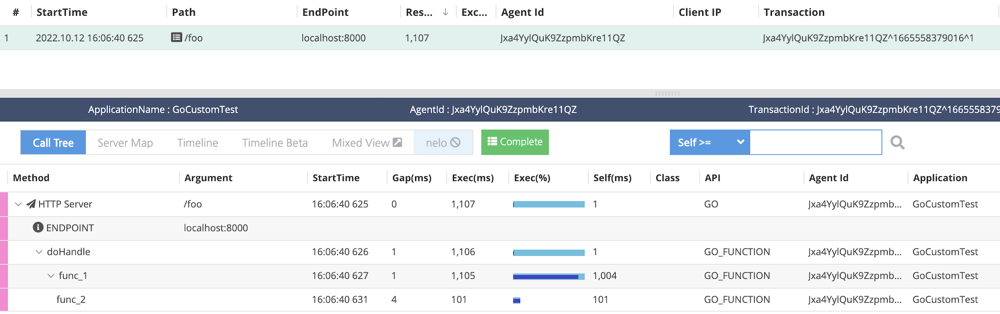
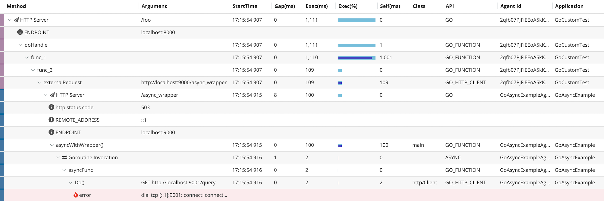

# Custom Instrumentation

Pinpoint Go Agent enables you to monitor Go applications using Pinpoint.
Go applications must be instrumented manually at the source code level,
because Go is a compiled language and does not have a virtual machine like Java.

There are two ways to instrument your applications:

* Using plugin packages.
* Custom instrumentation with the Pinpoint Go Agent API.

Pinpoint Go Agent provides plugins packages to help developers trace the popular frameworks and toolkits.
These packages help you to make instruments with simple source code modifications.
For more information on plugin packages, refer [Plugin User Guide](plugin_guide.md).

The API is thin and the rules it expects you to keep are not all obvious from
the signatures — a broken hand-written instrument almost always violates one of
them. Read [Tracer, Span, and Annotation Contracts](api_contracts.md)
alongside this guide; it is short, and it is what this document assumes.

## Overview

In Pinpoint, a transaction consists of a group of Spans.
Each span represents a trace of a single logical node where the transaction has gone through.
A span records important function invocations and their related data(arguments, return value, etc.)
before encapsulating them as SpanEvents in a call stack like representation.
The span itself and each of its SpanEvents represents a function invocation.

Find out more about the concept of Pinpoint at the links below:

* https://pinpoint-apm.gitbook.io/pinpoint/want-a-quick-tour/techdetail
* https://pinpoint-apm.gitbook.io/pinpoint/documents/plugin-dev-guide

## Span

Span represents a top-level operation in your application, such as an HTTP or RPC request.
To report a span, You can call Agent interface.

* **Agent.NewSpanTracer()** returns a span Tracer indicating the start of a transaction.
  A span is sampled according to a given sampling policy, and trace data is not collected if not sampled.

* **Agent.NewSpanTracerWithReader()** returns a span Tracer that continues a transaction passed from the previous node.
  A span is sampled according to a given sampling policy, and trace data is not collected if not sampled.
  Distributed tracing headers are extracted from the reader. If it is empty, new transaction is started.

The point at which the span can be created is the http or grpc server request handler.
The following is an example of creating a span from http server request handler:

``` go
func doHandle(w http.ResponseWriter, r *http.Request) {
    tracer = pinpoint.GetAgent().NewSpanTracerWithReader("HTTP Server", r.URL.Path, r.Header)
    defer tracer.EndSpan()

    span := tracer.Span()
    span.SetEndPoint(r.Host)
}
```

You can instrument a single call stack of application and makes the result a single span using Tracer interface.
**Tracer.EndSpan()** must be called to complete a span and deliver it to the collector.

The SpanRecorder and Annotation interface allow trace data to be recorded in a Span.

## SpanEvent

SpanEvent represents an operation within a span, such as a database query, a request to another service, or function call.
To report a span, You can call **Tracer.NewSpanEvent()**.
**Tracer.EndSpanEvent()** must be called to complete a span event.

The SpanEventRecorder and Annotation interface allow trace data to be recorded in a SpanEvent.

``` go
func doHandle(w http.ResponseWriter, r *http.Request) {
    tracer := pinpoint.GetAgent().NewSpanTracerWithReader("HTTP Server", r.URL.Path, r.Header)
    defer tracer.EndSpan()

    span := tracer.Span()
    span.SetEndPoint(r.Host)
    defer tracer.NewSpanEvent("doHandle").EndSpanEvent()
    
    func() {
        defer tracer.NewSpanEvent("func_1").EndSpanEvent()

        func() {
            defer tracer.NewSpanEvent("func_2").EndSpanEvent()
            time.Sleep(100 * time.Millisecond)
        }()
        time.Sleep(1 * time.Second)
    }()
}
```

The screenshot below is a pinpoint web screen showing the results of the above example.

 

## Distributed tracing context

If the request came from another node traced by a Pinpoint Agent, then the transaction will already have a transaction context.
Most of these data are sent from the previous node, usually packed in the request message. 
Pinpoint Go Agent provides two functions below to read and write these data.

* **Tracer.Extract**(reader DistributedTracingContextReader) extracts distributed tracing headers from the reader.
* **Tracer.Inject**(writer DistributedTracingContextWriter) injects distributed tracing headers to the writer.

Using **Agent.NewSpanTracerWithReader()**, you can create a span that continues the transaction started from previous node.
(Tracer.Extract() function is used internally to read the transaction context.)

If you request to another service and the next node is traceable, the transaction context must be propagated to the next node.
Tracer.Inject() is provided for this action.
The following is an example of instrumenting a http request to other node:

``` go
func externalRequest(tracer pinpoint.Tracer) int {
    req, err := http.NewRequest("GET", "http://localhost:9000/async_wrapper", nil)
    client := &http.Client{}

    tracer.NewSpanEvent("externalRequest")
    defer tracer.EndSpanEvent()

    se := tracer.SpanEvent()
    se.SetEndPoint(req.Host)
    se.SetDestination(req.Host)
    se.SetServiceType(pinpoint.ServiceTypeGoHttpClient)
    se.Annotations().AppendString(pinpoint.AnnotationHttpUrl, req.URL.String())
    tracer.Inject(req.Header)

    resp, err := client.Do(req)
    defer resp.Body.Close()

    tracer.SpanEvent().SetError(err)
    return resp.StatusCode
}
```

[Full Example](/example/custom/custom.go)

The screenshot below is a pinpoint web screen showing the results of the above example.
It can be seen that the call stack of the [next node](/example/async/async.go) that receives the http request is displayed as one transaction.

 

## Context propagation
In many Go APIs, the first argument to functions and methods is often context.Context. 
Context provides a means of other request-scoped values across API boundaries and between processes. 
It is often used when a library interacts — directly or transitively — with remote servers, such as databases, APIs, and the like.
For information on the go context package, visit https://golang.org/pkg/context.

Pinpoint Go Agent also uses Context to propagate the Tracer across API boundaries.
Pinpoint Go Agent provides a function that adds a tracer to the Context,
and a function that imports a tracer from the Context, respectively.

* **NewContext()** adds a tracer to the Context. 
* **FromContext()** imports a tracer from the Context.

The following is an example of propagating Tracer to the sql driver using Context:

``` go
func tableCount(w http.ResponseWriter, r *http.Request) {
    tracer := pinpoint.FromContext(r.Context())

    db, err := sql.Open("mysql-pinpoint", "root:p123@tcp(127.0.0.1:3306)/information_schema")
    defer db.Close()

    ctx := pinpoint.NewContext(context.Background(), tracer)
    row := db.QueryRowContext(ctx, "SELECT count(*) from tables")
    var count int
    row.Scan(&count)

    fmt.Println("number of tables in information_schema", count)
}
```

## Instrument Goroutine

The Pinpoint Tracer is designed to track a single call stack,
so applications can be crashed if a tracer is shared on goroutines.
The Tracer.NewGoroutineTracer() function should be called to create a new tracer that traces a goroutine,
and then pass it to the goroutine.

To pass the tracer to a goroutine, there is ways below:

* function parameter
* channel
* context.Context

The **Tracer.EndSpan()** function must be called at the end of the goroutine.

### Function parameter

``` go
func outGoingRequest(ctx context.Context) {
    client := pphttp.WrapClient(nil)
	
    request, _ := http.NewRequest("GET", "https://github.com/pinpoint-apm/pinpoint-go-agent", nil)
    request = request.WithContext(ctx)

    resp, err := client.Do(request)
    if nil != err {
        log.Println(err.Error())
        return
    }
    defer resp.Body.Close()
    log.Println(resp.Body)
}

func asyncWithTracer(w http.ResponseWriter, r *http.Request) {
    tracer := pinpoint.FromContext(r.Context())
    wg := &sync.WaitGroup{}
    wg.Add(1)

    go func(asyncTracer pinpoint.Tracer) {
        defer wg.Done()

        defer asyncTracer.EndSpan() // must be called
        defer asyncTracer.NewSpanEvent("asyncWithTracer_goroutine").EndSpanEvent()

        ctx := pinpoint.NewContext(context.Background(), asyncTracer)
        outGoingRequest(w, ctx)
    }(tracer.NewGoroutineTracer())

    wg.Wait()
}
```

### Channel

``` go
func asyncWithChan(w http.ResponseWriter, r *http.Request) {
    tracer := pinpoint.FromContext(r.Context())
    wg := &sync.WaitGroup{}
    wg.Add(1)

    ch := make(chan pinpoint.Tracer)

    go func() {
        defer wg.Done()

        asyncTracer := <-ch
        defer asyncTracer.EndSpan() // must be called
        defer asyncTracer.NewSpanEvent("asyncWithChan_goroutine").EndSpanEvent()

        ctx := pinpoint.NewContext(context.Background(), asyncTracer)
        outGoingRequest(w, ctx)
    }()

    ch <- tracer.NewGoroutineTracer()
    wg.Wait()
}
```

### Context

``` go
func asyncWithContext(w http.ResponseWriter, r *http.Request) {
    tracer := pinpoint.FromContext(r.Context())
    wg := &sync.WaitGroup{}
    wg.Add(1)

    go func(asyncCtx context.Context) {
        defer wg.Done()

        asyncTracer := pinpoint.FromContext(asyncCtx)
        defer asyncTracer.EndSpan() // must be called
        defer asyncTracer.NewSpanEvent("asyncWithContext_goroutine").EndSpanEvent()

        ctx := pinpoint.NewContext(context.Background(), asyncTracer)
        outGoingRequest(w, ctx)
    }(pinpoint.NewContext(context.Background(), tracer.NewGoroutineTracer()))

    wg.Wait()
}
```

### Wrapper function
**Tracer.WrapGoroutine()** function creates a tracer for the goroutine and passes it to the goroutine in context.
You don't need to call Tracer.EndSpan() because wrapper call it when the goroutine function ends.
Just call the wrapped function as goroutine.
We recommend using this function.

``` go
func asyncFunc(asyncCtx context.Context) {
    w := asyncCtx.Value("wr").(http.ResponseWriter)
    outGoingRequest(w, asyncCtx)
}

func asyncWithWrapper(w http.ResponseWriter, r *http.Request) {
    tracer := pinpoint.FromContext(r.Context())
    ctx := context.WithValue(context.Background(), "wr", w)
    f := tracer.WrapGoroutine("asyncFunc", asyncFunc, ctx)
    go f()
}
```

## Annotations

Annotations attach detail to a span or span event: the URL, the SQL, an
argument, a status code. Get an `Annotation` from the recorder you want to
annotate, and pick the `Append*` method matching the value shape.

```go
se := tracer.SpanEvent()
se.Annotations().AppendString(pinpoint.AnnotationHttpUrl, req.URL.String())
se.Annotations().AppendInt(pinpoint.AnnotationHttpStatusCode, resp.StatusCode)
```

### Predefined annotation keys

| Constant | Key | Typical value |
|---|---|---|
| `AnnotationArgs0` | -1 | first argument of the traced call (string) |
| `AnnotationApi` | 12 | API description string |
| `AnnotationSqlId` | 20 | SQL id / normalized statement metadata |
| `AnnotationSqlUid` | 25 | SQL uid metadata (murmur3 x64 128 of the normalized SQL, h1 then h2 little-endian, identical to the Java and C++ agents) |
| `AnnotationHttpUrl` | 40 | request URL |
| `AnnotationHttpParam` | 41 | query string |
| `AnnotationHttpCookie` | 45 | recorded cookies |
| `AnnotationHttpStatusCode` | 46 | response status |
| `AnnotationHttpRequestHeader` | 47 | recorded request headers |
| `AnnotationHttpResponseHeader` | 55 | recorded response headers |
| `AnnotationHttpProxyHeader` | 300 | proxy timing header |
| `AnnotationKafkaTopic` | 140 | topic |
| `AnnotationKafkaPartition` | 141 | partition |
| `AnnotationKafkaOffset` | 142 | offset |
| `AnnotationMongoJasonData` | 150 | command document |
| `AnnotationMongoCollectionInfo` | 151 | collection |
| `AnnotationEsDsl` | 173 | Elasticsearch query DSL |
| `AnnotationHbaseClientParams` | 320 | HBase operation parameters |

Custom keys are plain `int32` values. They are transmitted as-is, but only
render with a label if the key is registered in the Pinpoint web's annotation
key list; otherwise the UI shows the bare number.

Annotate before the span or event ends, and prefer an annotation over a
variable operation name — see
[the contracts](api_contracts.md#7-annotation-rules).

### What not to record

Annotations reach the collector as-is and are visible to everyone with access
to the Pinpoint UI. Do not annotate credentials, tokens, personal data or
whole request bodies. For SQL bind values there is a dedicated switch,
`SQL.TraceBindValue`; turn it off in environments where the parameters are
themselves sensitive.

## Error reporting

Marking a failure takes one call. `SpanRecorder.SetError()` fails the whole
transaction; `SpanEventRecorder.SetError()` fails one event and, as in the Java
agent, the transaction it belongs to, with an optional error name that groups
errors in the UI:

```go
resp, err := client.Do(req)
tracer.SpanEvent().SetError(err)                       // no nil check needed
tracer.SpanEvent().SetError(err, "UpstreamCallError")  // named group
```

A `nil` error is ignored, so the unguarded form above is correct. For a failure
that carries no Go `error` — an HTTP status that counts as an error, say — use
`SpanRecorder.SetFailure()`.

### Call stacks

`Error.TraceCallStack` records the stack where the error was created, and
`Error.CallStackDepth` bounds it. The agent reads the stack **from the error
value**, so this works with errors that carry one — those implementing
`StackTrace() errors.StackTrace`, as `github.com/pkg/errors` errors do:

```go
if err != nil {
    return errors.Wrap(err, "load user")   // github.com/pkg/errors
}
```

A plain `errors.New` error has no stack to record, and costs nothing extra when
the option is on. `Cause()` chains are followed to build the exception chain
shown in the UI, bounded at 64 links.

Stack capture and symbolization is the most expensive thing the agent does per
error, which is why it is off by default. Turn it on when you are diagnosing,
and keep the depth modest.

## Sampling policy

Sampling is decided once, when the span is created, and applies to the whole
transaction. An unsampled transaction produces a no-op tracer: your instruments
still run and record nothing.

There are two samplers, chosen by `Sampling.Type`:

| Type | Option | Meaning |
|---|---|---|
| `COUNTER` | `Sampling.CounterRate` | sample 1 in N. `1` is 100%, `100` is 1%, `0` is off |
| `PERCENT` | `Sampling.PercentRate` | sample N% (0.01 – 100) |

On top of either, two optional throughput limits cap how many transactions per
second are sampled, which is what protects a collector under a traffic spike:

* `Sampling.NewThroughput` — new transactions started at this node.
* `Sampling.ContinueThroughput` — transactions continued from an upstream node.

Both default to 0 (unlimited). All of these options are
[dynamic](config.md#dynamic-configuration): you can lower the rate on a running
process by editing the config file.

An upstream node's sampling decision wins for continued transactions — that is
what keeps a distributed trace whole rather than half-sampled.

`Tracer.IsSampled()` exists for instrumentation that is itself expensive
(serializing a payload to annotate, for example). Use it to skip that work, not
to decide whether to trace:

```go
if tracer.IsSampled() {
    se.Annotations().AppendString(pinpoint.AnnotationArgs0, expensiveDump(v))
}
```

## Instrument a database call

For a `database/sql` driver, prefer wrapping the driver over hand-writing
events — that is what the SQL plugins do, in one call:

```go
import "github.com/pinpoint-apm/pinpoint-go-agent"

var dbInfo = pinpoint.DBInfo{
    DBType:    pinpoint.ServiceTypeMysql,
    QueryType: pinpoint.ServiceTypeMysqlExecuteQuery,
    ParseDSN:  parseDSN, // fills in DBName and DBHost from the connection string
}

func init() {
    sql.Register("mydriver-pinpoint", pinpoint.WrapSQLDriver(mydriver.Driver{}, dbInfo))
}
```

`ParseDSN` is optional but worth writing: without it the UI has no database
name or host for the node.

The wrapper handles statement normalization, bind values, commit/rollback
events and query statistics, all governed by the `SQL.*`
[options](config.md#sqltracebindvalue). See any of the
[SQL plugins](plugin_guide.md#sql-databases) for a complete, short example.

For a non-`database/sql` backend, record it as a span event and set the fields
that make it render as a remote node in the UI:

```go
func fetch(ctx context.Context, key string) (string, error) {
    tracer := pinpoint.FromContext(ctx)
    defer tracer.NewSpanEvent("mystore.Get").EndSpanEvent()

    se := tracer.SpanEvent()
    se.SetServiceType(pinpoint.ServiceTypeRedis)  // the backend's service type
    se.SetDestination("my-store-cluster")         // logical name shown in the UI
    se.SetEndPoint("10.0.0.7:6379")               // address actually contacted

    v, err := store.Get(key)
    se.SetError(err)
    return v, err
}
```

`SetDestination()` is the node label on the server map, so keep it stable
(a cluster or logical database name), not per-connection.

## Instrument an HTTP server by hand

The [http plugin](plugin_guide.md#http-servers-and-web-frameworks) covers
`net/http` and every supported framework. Reach for these helpers when you have
a server the plugins do not cover, and you want the same recording behavior —
header/cookie recording, status handling, URL and method filters — without
re-implementing it:

```go
import pphttp "github.com/pinpoint-apm/pinpoint-go-agent/plugin/http"

func handle(w http.ResponseWriter, r *http.Request) {
    tracer := pphttp.NewHttpServerTracer(r, "MyServer")
    defer tracer.EndSpan()
    if !tracer.IsSampled() {
        next(w, r)
        return
    }

    status := http.StatusOK
    w = pphttp.WrapResponseWriter(w, &status)
    defer func() { pphttp.RecordHttpServerResponse(tracer, status, w.Header()) }()

    next(w, r)
}
```

`NewHttpServerTracer()` extracts the incoming trace context and records the
request; `WrapResponseWriter()` captures the status the handler actually wrote;
`RecordHttpServerResponse()` records the status and response headers.
`NewHttpServerTracerWithReader()` is the variant for a non-`net/http` carrier.

For an outgoing call:

```go
tracer := pphttp.NewHttpClientTracer(pinpoint.FromContext(ctx), "myclient.Do", req)
resp, err := client.Do(req)
pphttp.EndHttpClientTracer(tracer, resp, err)
```

`NewHttpClientTracer()` injects the tracing headers into `req`, so the
downstream node continues the transaction.

### URL statistics

URL statistics aggregate per-URL throughput and latency independently of
sampling — they are collected for unsampled transactions too, which makes them
the useful signal at low sampling rates. Enable `Http.UrlStat.Enable`; the
plugins collect them automatically. In a hand-written server, report the
**routed pattern**:

```go
pphttp.CollectUrlStat(tracer, "/users/{id}", r.Method, status)
```

Passing the resolved path instead would create one entry per id and exhaust
`Http.UrlStat.LimitSize`.

## Service types

`SetServiceType()` decides how a span or event renders in the UI. The commonly
useful constants:

| Constant | Value | Use |
|---|---|---|
| `ServiceTypeGoApp` | 1800 | the application itself (default `ApplicationType`) |
| `ServiceTypeGoFunction` | 1801 | an internal function call |
| `ServiceTypeGoHttpClient` | 9401 | outgoing HTTP request |
| `ServiceTypeAsync` | 100 | goroutine / async continuation |
| `ServiceTypeGrpc` / `ServiceTypeGrpcServer` | 9160 / 1130 | gRPC client / server |
| `ServiceTypeMysql` / `...ExecuteQuery` | 2100 / 2101 | MySQL connection / query |
| `ServiceTypeMssql` / `...ExecuteQuery` | 2200 / 2201 | SQL Server |
| `ServiceTypeOracle` / `...ExecuteQuery` | 2300 / 2301 | Oracle |
| `ServiceTypePgSql` / `...ExecuteQuery` | 2500 / 2501 | PostgreSQL |
| `ServiceTypeCassandraExecuteQuery` | 2601 | Cassandra query |
| `ServiceTypeMongo` / `ServiceTypeMongoExecuteQuery` | 2650 / 2651 | MongoDB |
| `ServiceTypeRedis` | 8203 | Redis |
| `ServiceTypeMemcached` | 8050 | Memcached |
| `ServiceTypeKafkaClient` | 8660 | Kafka |
| `ServiceTypeHbaseClient` | 8800 | HBase |
| `ServiceTypeGoElastic` | 9204 | Elasticsearch |

## Correlating your logs

`LogTransactionIdKey` (`PtxId`) and `LogSpanIdKey` (`PspanId`) are the field
names Pinpoint looks for when linking a span to your application logs. The
[logrus plugin](plugin_guide.md#logging-integration) sets them for you; with
any other logging library, add them yourself and call
`tracer.Span().SetLogging(pinpoint.Logged)` so the UI knows a log line exists
for the span.

## Checklist for a new instrumentation

Before shipping a hand-written instrument:

- [ ] Every `NewSpanEvent()` is paired with `EndSpanEvent()` in a single
      `defer`, so an early return or panic cannot leave it open.
- [ ] `EndSpan()` runs exactly once, via `defer`, on every path.
- [ ] Operation names are fixed strings; per-request values are annotations.
- [ ] A root span's `rpcName` is the routed pattern, not the resolved path.
- [ ] Goroutines get their own tracer (`WrapGoroutine()` or
      `NewGoroutineTracer()`), never a shared one.
- [ ] Outbound calls `Inject()` (directly, or via a client wrapper) and receive
      the tracer through a context.
- [ ] Errors are recorded with `SetError()`; a `nil` error needs no guard.
- [ ] Remote calls set service type, destination and endpoint.
- [ ] No credentials or personal data in annotations.
- [ ] Verified once with `PINPOINT_GO_LOG_LEVEL=debug`, with no `src=span`
      warnings — the shared-tracer check only runs at that level.

---

## Related Documentation

* [Quick Start](quick_start.md)
* [Tracer, Span, and Annotation Contracts](api_contracts.md)
* [Plugin User Guide](plugin_guide.md)
* [Configuration](config.md)
* [Troubleshooting](troubleshooting.md)
